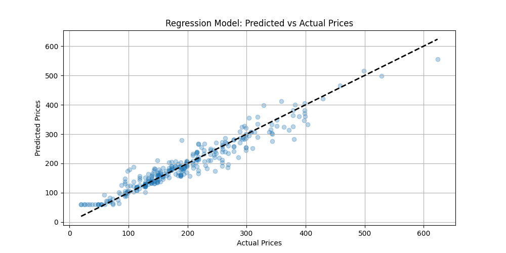
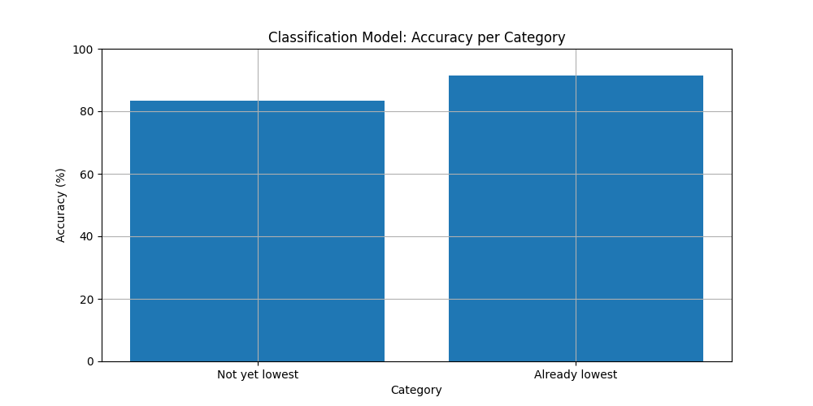

# NeuroFlight: Predict Price Trends & Lowest Fares via Neural Networks

## Live demo: https://neuroflight.netlify.app/


## Overview
The Neuroflight project predicts the best **time** to buy flight tickets at the **lowest** prices using a **Regression Model** and a **Classification Model**. It features a **web interface** and has a backend devleoped and hosted with **AWS Lambda and API Gateway**.


## Key Features

| **Feature**                     | **Description**                                                                                  |
|---------------------------------|--------------------------------------------------------------------------------------------------|
| **Dual Model Approach**         | - Regression model for minimum price prediction <br> - Classification model to determine if the minimum price is in the future or has passed  |
| **Web Interface**               | User-friendly website for easy predictions and visualization                                     |
| **AWS Backend**                 | Model deployment using AWS Lambda and API Gateway with REST API                                  |
| **Accuracy**                    | - Regression model: R² = 0.92 <br> - Classification model: 88%                                      |
| **Rate Limiting**               | Implemented to prevent API overuse and control costs                                             |
| **TensorBoard Integration**     | For training visualization and analysis                                                          |


## Dataset

The project utilizes a comprehensive dataset scraped from Expedia, comprising over 82 million rows of flight ticket data. This data covers flights between April 16, 2022, and October 5, 2022, for major airports in the United States.

### Key Features in the Dataset:
| **Field**               | **Description**                                       |
|-------------------------|-------------------------------------------------------|
| **legId**               | Unique identifier for each flight                     |
| **searchDate**          | Date of the data entry (YYYY-MM-DD)                   |
| **flightDate**          | Scheduled flight date (YYYY-MM-DD)                    |
| **startingAirport**     | IATA code for departure airport                       |
| **destinationAirport**  | IATA code for arrival airport                         |
| **travelDuration**      | Flight duration in hours and minutes                  |
| **isNonStop**           | Boolean indicating if the flight is direct            |
| **baseFare**            | Base ticket price (USD)                               |
| **totalFare**           | Total price including taxes and fees (USD)            |
| **segmentsCabinCode**   | Class of travel (e.g., "coach")                       |
| **segmentsAirlineCode** | Airline code                                          |


## Data Preprocessing

The data underwent extensive cleaning and feature engineering:

| **Step**                              | **Description**                                                                                                 |
|---------------------------------------|-----------------------------------------------------------------------------------------------------------------|
| **1. Loading Data**                   | The dataset is loaded in chunks to handle its large size efficiently.                                            |
| **2. Filtering**                      | Rows are filtered to keep only non-stop, non-basic economy, non-refundable flights in the coach class.           |
| **3. Date Conversion**                | Dates are stripped of their year and a "day of week" feature is implemented.                                     |
| **4. Calculating Days Until Flight**  | A new feature representing the number of days until the flight from the search date is calculated.               |
| **5. Finding Minimum Prices**         | The lowest price for each flight leg and the corresponding date are tracked and added as a column.               |
| **6. Calculating Lowest Price Day Left** | A new feature representing the number of days left until the flight at the lowest price is calculated.         |
| **7. Dropping Unnecessary Columns**   | Several columns that are not required for the model are dropped.                                                 |
| **8. Formatting Dates**               | Dates are reformatted to remove the year, focusing on month and day only.                                        |
| **9. Price Trend Classification**     | A new feature is created, classifying each row as "Not yet lowest" or "Already lowest".                          |
| **10. Feature Selection**             | - Categorical features: 'startingAirport', 'destinationAirport', 'segmentsAirlineCode'                           |
|                                       | - Numeric features: 'travelDuration', 'totalFare', 'daysUntilFlight', 'flightDayOfWeek', 'flightDayOfMonth', 'flightMonth' |
| **11. Feature Preprocessing**         | - Categorical features: One-hot encoded using scikit-learn's OneHotEncoder                                       |
|                                       | - Numeric features: Standardized using scikit-learn's StandardScaler                                             |
| **12. Target Variable Preparation**   | - Regression target (y1): 'lowestPrice'                                                                          |
|                                       | - Classification target (y2): 'price_trend' (encoded using LabelEncoder)                                         |
| **13. Data Splitting**                | The preprocessed data is split into training and testing sets.                                                   |
| **14. Preprocessing Model Persistence** | The preprocessor and label encoder are saved using joblib for later use during inference.                      |


## Model Architecture

The project uses two separate neural network models: one for regression (price prediction) and one for classification (price trend prediction). Both models are implemented using PyTorch.

### Regression Model (RegressionNNPrice)

The regression model predicts the lowest price for a given flight. Its architecture is as follows:

| **Layer**            | **Description**                                                                 |
|----------------------|---------------------------------------------------------------------------------|
| **Input layer**      | Dimension matches the preprocessed feature space                                |
| **Hidden layers**    | Six fully connected layers with dimensions: 512 → 256 → 128 → 64 → 32 → 1       |
| **Batch normalization** | Applied after each layer (except the output layer)                           |
| **Activation function** | ReLU activation after each layer (except the output layer)                   |
| **Dropout**          | Dropout (p=0.1) applied after each hidden layer for regularization              |

*(I am aware that this is extremely overkill, I was just experimenting with different structures, and there did not seem to be any overfitting issues)*
### Classification Model (ClassificationNNTrend)

The classification model predicts whether the price trend is increasing, decreasing, or stable. Its architecture is as follows:

| **Layer**            | **Description**                                                                 |
|----------------------|---------------------------------------------------------------------------------|
| **Input layer**      | Dimension matches the preprocessed feature space                                |
| **Hidden layers**    | Seven fully connected layers with dimensions: 512 → 256 → 128 → 64 → 32 → 16 → 3|
| **Batch normalization** | Applied after each layer (except the output layer)                           |
| **Activation function** | ReLU activation after each layer (except the output layer)                   |
| **Dropout**          | Dropout (p=0.1) applied after each hidden layer for regularization              |

*(I am also aware that this is extremely overkill, I was just experimenting with different structures, and there did not seem to be any overfitting issues)*
## Training

| **Component**           | **Description**                                                                                         |
|-------------------------|---------------------------------------------------------------------------------------------------------|
| **Optimizer**           | Adam optimizer is used for both models.                                                                 |
| **Loss Functions**      | Regression Model: Mean Squared Error (MSE) loss <br> Classification Model: Cross-Entropy loss           |
| **Model Checkpointing** | The model weights for each epoch are saved during training for later use in inference.                  |


## Deployment

To broaden my skills in back-end server work, I decided to create a back-end and front-end structure for this project. While it may not be strictly necessary—since I can run the model in the browser using ONNX.js, as I did in my previous [MNIST project](https://github.com/ngivan2004/Handwriting-PyTorch-Neural-Network-RealTime)—I chose this approach to gain more experience.


To implement this, I opted to use AWS and incorporated Docker for containerization.

| **Component**               | **Description**                                                                                       |
|-----------------------------|-------------------------------------------------------------------------------------------------------|
| **AWS Lambda**              | - Serverless functions for model inference. <br> - Used Docker to create image for Lambda function. <br> - Separate functions for regression and classification models. |
| **API Gateway**             | - REST API endpoints for model access with CORS implementation.                                    |
| **Rate Limiting**           | - Prevents API abuse and controls costs. <br> - Implemented at the API Gateway level.                 |


## Web Interface

The project features a responsive web interface for easy interaction with the models. Try it out on https://aiflight.netlify.app/


## Performance Metrics

- **Regression Model**: 
  - R² (Coefficient of Determination): 0.92
  -  *(n=300)*

- **Classification Model**:
  - Accuracy: 88%
  -  Note that "Already lowest" in here means that the current price is the minimum, or that the minimum is in the past; and "Not yet lowest" means the minimum is in the future. *(n=300)*
  - Confusion Matrix:<br>
     *(n=300)*


## Limitations

| **Aspect**            | **Details**                                                                                                                                       |
|-----------------------|---------------------------------------------------------------------------------------------------------------------------------------------------|
| **Date Range**        | The model is trained on data from April to October 2022, which may limit its accuracy for other periods. Hence we also placed a limit on the date range when in inference to prevent unreasonable outputs. We hope that this issue affects the date range but not too much on accuracy, as we also engineered a "day of week" feature to try and counter that effect across years. |
| **Geographic Scope**  | Currently focuses on major US airports only.                                                                                                      |
| **Airline Coverage**  | May not include all airlines or special fare classes.                                                                                             |
| **External Factors**  | Does not account for unpredictable events (e.g., pandemics, major policy changes, infation).                                                                |


## Usage Guide

**We have a live demo available at https://aiflight.netlify.app/**, and I highly encourage you to check it out. If you cloned the repository, you can host it locally by following the steps below or use the Python inference GUI.

Cleaning and processing data can be quite a trial-and-error process, and my development journey was no exception. The initial stages were far from streamlined, and may not be as organized as they could be. You've been warned!

To run the website locally, follow these steps:

1. **Set up a Python server in the website subdirectory.**
2. **Navigate to `index.html`.**

You can also try out the Python inference GUI by running `inference_double_classification.py` after installing all the libraries needed in requirements.txt.

You can review the code for the Lambda functions in the `aws_lambda_backend` folder, which contains the necessary files and the Dockerfile used to create the image.

If you want to train the model, follow these steps:

**Warning:** Before proceeding, please note that the process of training the model can be quite messy. The initial stages were far from streamlined, and things were often not as organized as they could be. Even with these instructions, things may still not work as expected. Proceed with caution!

1. **Install the required packages:**
   ```bash
   pip install -r requirements.txt
   ```
1. **Obtain the dataset and place it in a `data` folder.**
2. **Move the following scripts from the `tools` folder to the main directory:**
   - `clean_up.py`
   - `parse_after_clean.py`
   - `fix_imbalance.py`
3. **Run the scripts in order:**
   - `clean_up.py`
   - `parse_after_clean.py`
   - `fix_imbalance.py`
   - `train_model_double_classification.py`

Additionally, you can run evaluations using `eval_double_classification.py`.

Explore the `tools` folder for some neat scripts, which may or may not have been used in production.


## Acknowledgements

- Dataset source: [FlightPrices by dilwong](https://github.com/dilwong/FlightPrices)
